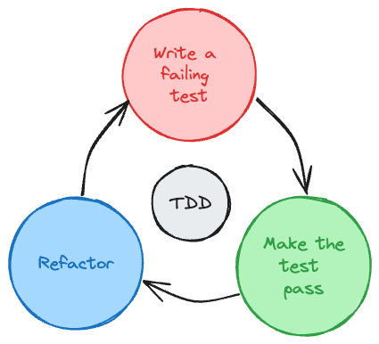

## Overview:

This repository contains solutions for two problems implemented using the Test-Driven Development (TDD) approach.

Problem 1: Repeated Subsequence Check

Problem 2: Matrix Diagonal Sum

## What is Test-Driven Development(TDD)?

Test-Driven Development (TDD) is a software development approach in which tests are written before the actual code. The process involves the following cycle:

* **Write a Test:** First, a small, specific test is created to define a certain behavior or functionality the software should exhibit. This test initially fails because the code to support it doesn’t exist yet.

* **Write Code**: Next, the minimum amount of code necessary to pass the test is written. This often means writing just enough code to fulfill the requirements of the test, nothing more.

* **Run Tests**: All tests are executed. The newly created test should fail, indicating that the functionality is not yet implemented. Existing tests should still pass.

* **Refactor Code**: Refactor the code to ensure it meets coding standards and is clean, clear, and efficient. This step doesn't introduce new functionality, but it improves the structure and readability of the code.

* **Repeat the Cycle**: The process continues by writing more tests for new functionality or adjusting existing ones. These new tests will initially fail until the code is written to pass them.

TDD encourages a more structured and incremental approach to software development. It helps in maintaining code quality, provides a safety net for future changes, and promotes a clear understanding of what the code should do. By continually running and building upon tests, developers gain confidence in the correctness of their code.

## How TDD is applied?

### **Problem 1:**
Given a string, check if a repeated subsequence is present in it or not. The repeated subsequence should have a length of 2 or more.

#### **Approach:**

Implement a function to detect the presence of a repeated subsequence.
The function should accept a string and return a boolean indicating whether a repeated subsequence exists or not.

*Colleague's(Mayank's):* Tester

Tests created:

test for vaild repeated subsequence, test for wrong repeated subsequence string, test for empty string

*My:* Developer

*Code written with necessary refactorings:*

Add RepeatedSubsequence class, logic for repeated subsequence, condition to check empty string first, Refactor RepeatedSubsequence logic

### **Problem 2:**
Given a matrix `matrix`, return the sum of the matrix diagonals.

#### **Approach:**

Create a function that computes the sum of both the primary and secondary diagonals in a matrix.
The function should take a matrix as input and return the sum of the diagonal elements.

#### Roles:

*My:* Tester

*Tests created:*

test case to check matrix is empty, test case to check square matrix, test case to check odd square matrix, test to get sum of diagonal of matrix, Remove test to check odd square matrix

*Colleague's(Mayank's):* Developer

*Code written with necessary refactorings:*

funtion to check empty matrix, function to check square matrix, function to check square and odd matrix, funtion to calculate sum of matrix diagonal elements, remove code for checking odd square matrix